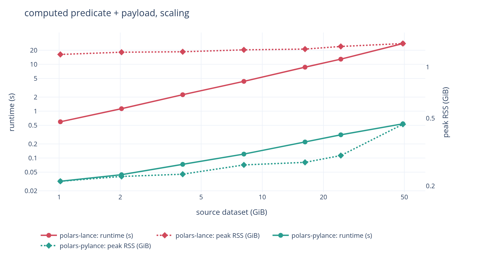
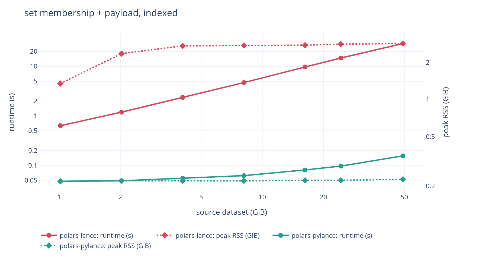
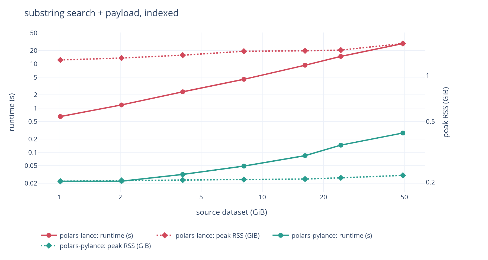
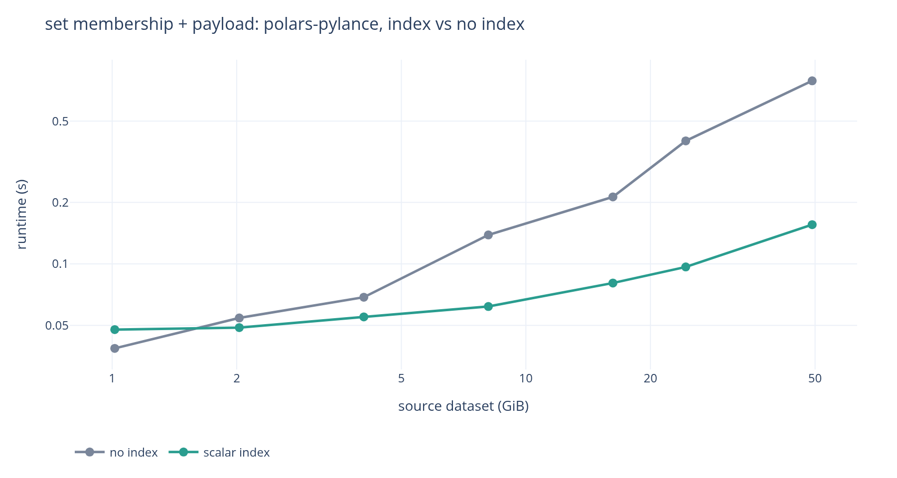
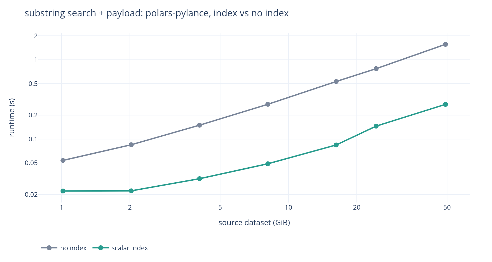

# Comparison with `jorritsandbrink/polars-lance`

[`jorritsandbrink/polars-lance`](https://github.com/jorritsandbrink/polars-lance)
(PyPI `polars-lance` 0.5.0) solves the same problem with a different architecture:
a compiled Rust extension linking the `lance` crate, versus polars-pylance's pure
Python built on `pylance`.

Measured on 2026-08-27 against their published wheel 0.5.0 and this working
copy, on `polars` 1.44.1 and `pylance` 10.0.0. Used a 1 GiB to 49.2 GiB dataset
ladder on an AWS instance `m8id.4xlarge` (16 vCPU Xeon 6975P-C, 64 GiB RAM,
885 GB local NVMe).

301 measurements, reproducible with [`bench`](bench/README.md).
Raw data is committed as `bench/results-m8id4xl.jsonl`.

---

## At a glance

| | `polars-lance` (0.5.0) | `polars-pylance` |
| --- | --- | --- |
| Implementation | Rust extension (`pyo3`, `maturin`), links `lance` 0.38.2 | Pure Python on `pylance` |
| Polars hook | `register_io_source` | `register_io_source` |
| Runtime deps | `polars>=1.0.0` only -- Lance is statically linked | `polars>=1.44.0`, `pylance>=9`, `pyarrow` |
| Read | lazy, streaming | lazy, streaming |
| Write | eager `DataFrame` only | streaming from a `LazyFrame` |
| Predicate pushdown into Lance | **no** (acknowledged `TODO`; filters in Rust polars) | yes, as a Lance SQL filter |
| Scalar indices usable from a query | no, since no predicate reaches Lance | yes |

## Architecture

### `polars-lance`

`polars-lance` calls `register_io_source` with a Rust `LanceScanner` behind it, so
per-batch work never touches the interpreter. Lance is compiled in: no `pylance`
at runtime, verified by installing the `polars-lance` wheel with only polars present:
both scan and write work. The cost is a 60–68 MB platform wheel per Python version
(15 wheels for 0.5.0) and coupling to polars' internal Rust API.

### `polars-pylance` (this package)

`polars-pylance` uses the same public hook, and the difference is what it does
with the arguments. `register_io_source` hands the source the projection, the row
limit and the *whole* predicate as a `polars.Expr`; polars-pylance translates
that expression into a Lance SQL filter string and passes it, the projection and
the limit to `lance.LanceDataset.scanner()`, so Lance does the page skipping,
the scalar-index lookup and the early stop. It needs `pylance` (a 76 MB wheel)
but is itself pure Python: no build step, no per-platform wheels, and it
inherits every Lance feature `pylance` exposes.

## Read features

| | `polars-lance` | `polars-pylance` |
| --- | --- | --- |
| Projection pushdown | yes | yes |
| Row-limit pushdown | yes | yes (when no filter follows the scan) |
| Predicate pushdown into Lance | no | yes (translated to a Lance SQL filter) |
| Predicate shapes that reach Lance | none | 52 of 55 tested |
| `is_in`, string functions, arithmetic, temporal parts | filtered afterwards | pushed |
| BTREE / BITMAP / NGRAM scalar indices | unreachable | used |
| Late materialisation of wide columns | no | yes, the filter runs first |
| Early stop on `.head()` | yes | yes |
| `storage_options` (S3/Azure/GCS) | yes | yes |
| Version / tag pinning, time travel | no | yes |
| Vector search (`nearest`) | no | yes |
| Full-text search | no | yes |
| `_rowid` / `_rowaddr` | no | yes |
| Per-fragment scans, sharding | no | yes (`scan_lance_fragments`) |
| Reader tuning (`io_buffer_size`, readahead) | no | yes (`LanceScanOptions`) |
| Scan-plan serialization (Polars Cloud) | untested | yes, 2–6 kB, round-trip tested |
| Distributed write to Lance (Polars Cloud) | no | yes (`cloud.sink_lance_remote`) |

## Write features

| | `polars-lance` | `polars-pylance` |
| --- | --- | --- |
| Input | `pl.DataFrame` (eager) | `pl.LazyFrame` (streamed) |
| Larger-than-memory writes | no -- caller must chunk manually | yes |
| Modes | `error`, `append`, `overwrite` | `create`, `append`, `overwrite`, `merge` (upsert) |
| File-layout control | `max_rows_per_file`, `max_bytes_per_file` | all `lance.write_dataset` kwargs |
| Deferred / composable sink | no | yes (`lazy=True`) |
| Parallel fragment write + single commit | no | yes (`write_lance_fragments`) |

This is the sharpest difference. `write_lance(df, ...)` requires a materialized
`DataFrame`, so writing the result of a large query means holding it in RAM:

```python
polars_lance.write_lance(lf.collect(), "out.lance")  # full result in memory
polars_pylance.sink_lance(lf, "out.lance")  # here: streamed batch by batch
```

The cost of that shows up as soon as the data is big: writing from a 49.2 GiB
source, `polars-lance` peaks at **51.22 GiB** against `polars-pylance`'s
**1.60 GiB**. See [the write benchmarks](#write-benchmarks).

## Correctness and stability issues in `polars-lance`

I ran into a few problems while benchmarking. They look easily fixable, and are
reported upstream rather than dissected here:

- [#10](https://github.com/jorritsandbrink/polars-lance/issues/10): the scanner
  is `unsendable`, so a scan aborts probabilistically. The benchmark retries
  three times and `r_proj` still has no result above 2 GiB.
- [#11](https://github.com/jorritsandbrink/polars-lance/issues/11): predicates
  containing `is_in`, `is_null`, `is_nan` and friends fail to deserialize,
  because the linked `polars` crate is behind the Python one. The benchmark
  retries those with Polars' predicate pushdown disabled, which runs and is the
  same work, since `polars-lance` pushes no predicate into Lance either way.
- [#14](https://github.com/jorritsandbrink/polars-lance/issues/14): the reason 
  `bench/analyse.py` compares answers rather than only times: the same mismatch
  can decode into a *different* operation instead of failing, and then the query
  is silently wrong.

# Benchmark results

## Write benchmarks


| write filtered projection | `polars-lance` | `polars-pylance` | |
| --- | --- | --- | --- |
| 4.1 GiB | 4.4 s / 4.65 GiB | 1.4 s / 1.42 GiB | 3.1× faster, 0.31× mem |
| 16.2 GiB | 15.4 s / 17.23 GiB | 5.5 s / 1.70 GiB | 2.8× faster, 0.10× mem |
| 24.3 GiB | 23.7 s / 25.65 GiB | 8.3 s / 1.71 GiB | 2.9× faster, 0.07× mem |
| 49.2 GiB | 64.3 s / 51.22 GiB | 23.1 s / **1.60 GiB** | 2.8× faster, **0.03× mem** |

`write_lance` takes a materialised `DataFrame`, so its peak tracks the result:
51.22 GiB to write from a 49.2 GiB source, which is most of a 64 GiB machine.
`sink_lance` streams, so `polars-pylance` is flat at 1.0–1.7 GiB across a 49×
range of input, and also 2.8–3.1× faster, because materialising costs time
nobody spends when streaming.

### A fixed budget of 8GiB RAM

The previous **scaling** pass uses a generous cap so nothing is constrained,
and shows how peak RSS and runtime grow with the data.
The **fixed-budget** pass pins memory at 8 GiB with swap
disabled and grows the data past it, which is the question that decides whether
a job exists at all:


| write, 8 GiB budget | `polars-lance` | `polars-pylance` |
| --- | --- | --- |
| 4.1 GiB | 6.5 s / 4.67 GiB | 1.4 s / 1.32 GiB |
| 8.1 GiB | **OOM-killed** | 3.0 s / 1.50 GiB |
| 24.3 GiB | **OOM-killed** | 12.3 s / 1.57 GiB |
| 49.2 GiB | **OOM-killed** | 27.8 s / 1.79 GiB |

In 8 GiB, `polars-lance` writes at most ~4 GiB of source. `polars-pylance` writes 
49.2 GiB, the largest tier measured, at 1.79 GiB peak, and the ladder stopped before 
the streaming writer did. Reads are fine on both under the same budget, so this is
specific to the write path.

## Read benchmarks

### Predicate pushdown

Four predicates, each in front of the payload column, at 49.2 GiB:

| predicate | `polars-lance` | `polars-pylance` | |
| --- | --- | --- | --- |
| `val * 2 > 1.999` | 27.8 s / 1.38 GiB | 0.5 s / 0.46 GiB | **52× faster, 3x lighter** |
| `id.is_in(200 ids)` | 28.4 s / 2.83 GiB | 0.8 s / 0.24 GiB | **36× faster, 12× lighter** |
| `ts.dt.hour() < 1` | 27.0 s / 1.45 GiB | 1.3 s / 0.83 GiB | **22× faster, 1.8x lighter** |
| `text.str.contains("-rare")` | 28.6 s / 1.57 GiB | 1.6 s / 0.32 GiB | **18× faster, 4.9x lighter** |

`polars-lance` receives the predicate and filters after reading, which is the
acknowledged `TODO`. `polars-pylance` translates the Polars expression into a
Lance SQL filter, so the scanner evaluates it, skips pages it cannot match, and
never materialises the 512-byte payload for rows that do not survive.

Three of those four are measured with Polars' predicate pushdown turned off on
the `polars-lance` side, because its scan node refuses the expression outright
(see [above](#correctness-and-stability-issues-in-polars-lance)).



None of these four can be expressed as a PyArrow expression, which is the
ceiling for `pl.scan_pyarrow_dataset` and for Polars' own `scan_delta` and
`scan_iceberg` hook. Of 55 predicate shapes run through a real scan, that route
gets 11 to Lance and this one gets 52. `docs/PUSHDOWN.md` has the table and the
three deliberate exceptions.

A predicate that only partly translates is pushed as far as it goes and finished
in Polars, so the answer never depends on how much of it Lance understood.

### Full scan


| full scan + payload aggregate | `polars-lance` | `polars-pylance` |
| --- | --- | --- |
| 1.0 GiB | 0.7 s / 1.14 GiB | 0.7 s / 0.46 GiB |
| 16.2 GiB | 9.1 s / 1.26 GiB | 10.3 s / 0.58 GiB |
| 49.2 GiB | 27.1 s / 1.36 GiB | 32.9 s / 0.58 GiB |

`polars-lance` is 1.1–1.2× faster on a full scan at *every* tier. That is the
per-batch Python cost, and it neither grows nor shrinks with scale. Both stream,
so neither peak grows with the data, but `polars-pylance` holds 0.46 → 0.58 GiB
while the source grows 49×, against `polars-lance`'s 1.14 → 1.36 GiB.

### Scalar indices

An index cannot help a filter that never reaches the scanner, so building one
changes nothing on the `polars-lance` side. The same queries, after BTREE
indices on `id` and `val`, BITMAP on `cat` and NGRAM on `text`:

| predicate, 49.2 GiB | `polars-lance` | `polars-pylance`, no index | `polars-pylance`, indexed |
| --- | --- | --- | --- |
| `id.is_in(200 ids)` | 28.9 s | 0.8 s | **0.2 s** |
| `text.str.contains("-rare")` | 28.9 s | 1.6 s | **0.3 s** |
| `val > 0.999` | 0.4 s | 0.9 s | 0.4 s |

| membership, indexed | substring, indexed |
| --- | --- |
|  |  |

`polars-lance` line climbs with the data and `polars-pylance` is flat, which is **186×** on
membership and **106×** on substring at the top tier.

The same two queries with and without the index, `polars-pylance` only, is where the index
itself shows up:

| membership, BTREE | substring, NGRAM |
| --- | --- |
|  |  |

The indexed lines are flat while the unindexed ones grow, which is the whole
point of an index and is visible only because the predicate got there.

`ts.dt.hour() < 1` is the control: no index can answer a computed temporal part,
and it does not move (1.25 s to 1.32 s).
