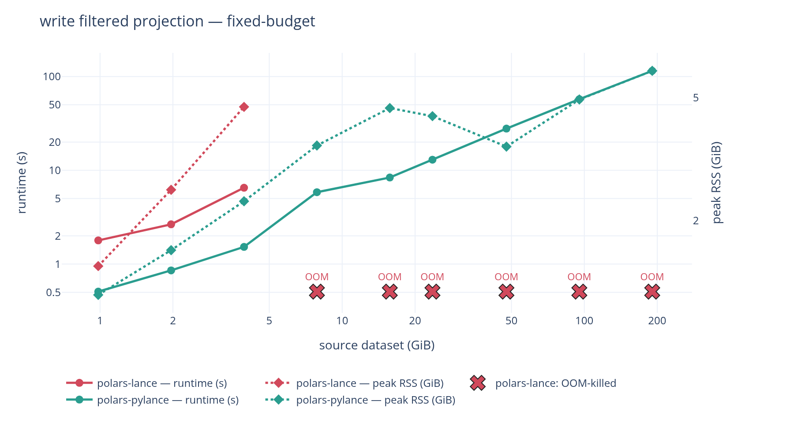
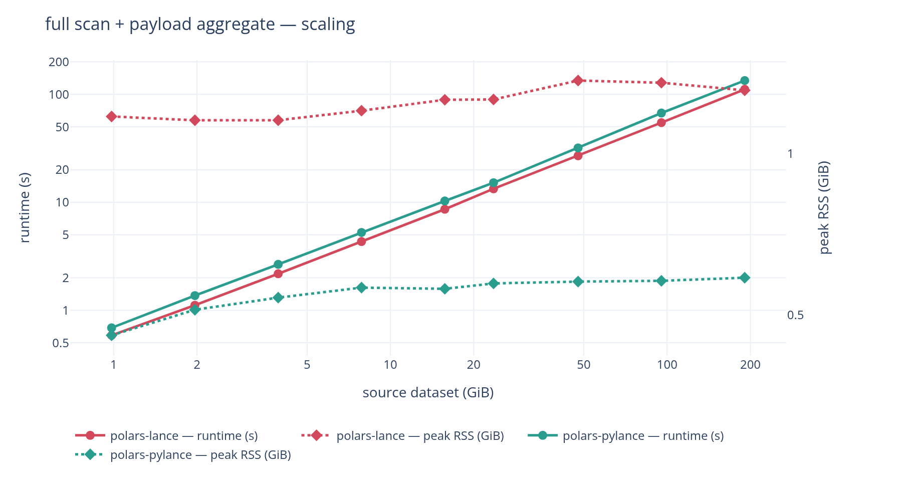
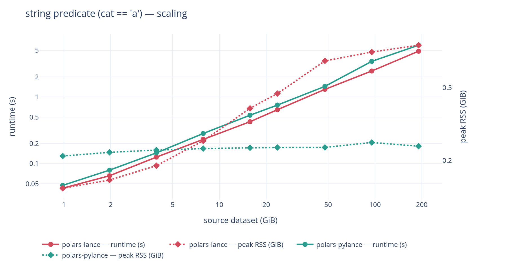
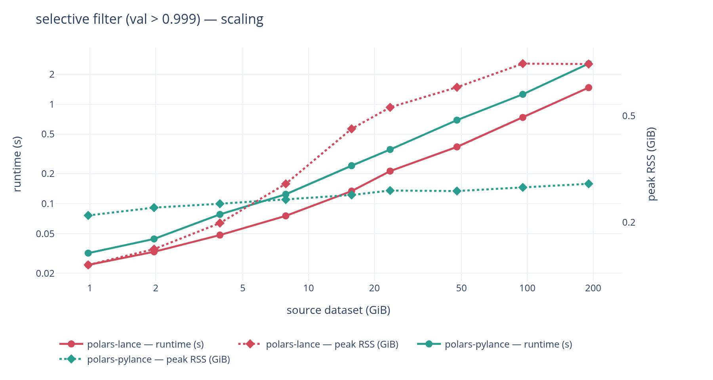
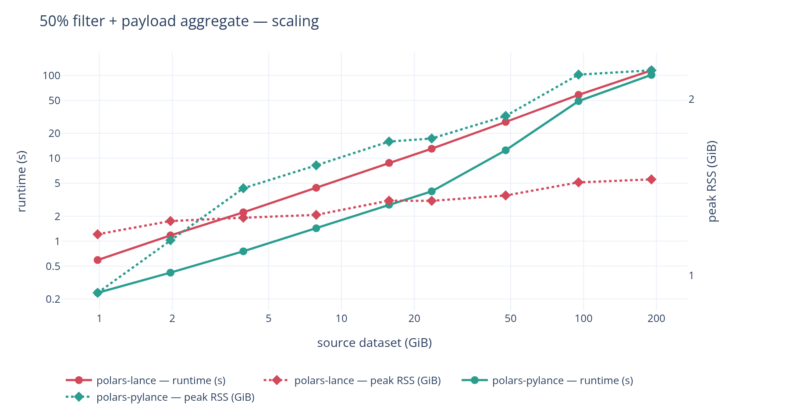

# Comparison with `jorritsandbrink/polars-lance`

[`jorritsandbrink/polars-lance`](https://github.com/jorritsandbrink/polars-lance)
(PyPI `polars-lance` 0.5.0) solves the same problem with a different architecture:
a compiled Rust extension linking the `lance` crate, versus polars-pylance's pure
Python built on `pylance`.

Measured on 2026-08-24 against their published wheel 0.5.0 and this working
copy, on `polars` 1.44.0 and `pylance` 10.0.0. Used a 1 GiB to 190.7 GiB
dataset ladder on an AWS instance `m8id.4xlarge` (16 vCPU Xeon 6975P-C,
64 GiB RAM, 885 GB local NVMe).

212 measurements, reproducible with [`bench`](bench/README.md).
Raw data is committed as `bench/results-m8id4xl.jsonl`.

---

## At a glance

| | `polars-lance` (0.5.0) | `polars-pylance` |
| --- | --- | --- |
| Implementation | Rust extension (`pyo3`, `maturin`), links `lance` 0.38.2 | Pure Python on `pylance` |
| Polars hook | `register_io_source` | dataset-provider hook |
| Runtime deps | `polars>=1.0.0` only -- Lance is statically linked | `polars>=1.44.0`, `pylance>=9`, `pyarrow` |
| Read | lazy, streaming | lazy, streaming |
| Write | eager `DataFrame` only | streaming from a `LazyFrame` |
| Predicate pushdown into Lance | **no** (acknowledged `TODO`; filters in Rust polars) | yes |

## Architecture

### `polars-lance`

`polars-lance` calls `register_io_source` with a Rust `LanceScanner` behind it, so
per-batch work never touches the interpreter. Lance is compiled in: no `pylance`
at runtime, verified by installing their wheel with only polars present -- both
scan and write work. The cost is a 60–68 MB platform wheel per Python version
(15 wheels for 0.5.0) and coupling to polars' internal Rust API.

### `polars-pylance` (this package)

`polars-pylance` hands Polars a provider object through the private
`PyLazyFrame.new_from_dataset_object` constructor, which puts a dataset-scan node
in the query IR rather than an opaque source. Polars resolves the schema up
front, then calls back with the pushdown already worked out -- projection, a
PyArrow predicate, a row limit -- and those go straight to
`lance.LanceDataset.scanner()`, so Lance does the page skipping and the early
stop and nothing is re-filtered in Python afterwards. It needs `pylance` (a 76 MB
wheel) but is itself pure Python: no build step, no per-platform wheels, and it
inherits every Lance feature `pylance` exposes.

## Read features

| | `polars-lance` | `polars-pylance` |
| --- | --- | --- |
| Projection pushdown | yes | yes |
| Row-limit pushdown | yes | yes (when no filter follows the scan) |
| Predicate pushdown into Lance | no | yes (ready-made PyArrow expression) |
| Early stop on `.head()` | yes | yes |
| `storage_options` (S3/Azure/GCS) | yes | yes |
| Version / tag pinning, time travel | no | yes |
| Vector search (`nearest`) | no | yes |
| Full-text search | no | yes |
| `_rowid` / `_rowaddr` | no | yes |
| Per-fragment scans, sharding | no | yes (`scan_lance_fragments`) |
| Reader tuning (`io_buffer_size`, readahead) | no | yes (`LanceScanOptions`) |
| Scan-plan serialization (Polars Cloud) | untested | yes, 2–6 kB, round-trip tested |
| Distributed write to Lance (Polars Cloud) | no | yes (`cloud.sink_lance_remote`) |

## Write features

| | `polars-lance` | `polars-pylance` |
| --- | --- | --- |
| Input | `pl.DataFrame` (eager) | `pl.LazyFrame` (streamed) |
| Larger-than-memory writes | no -- caller must chunk manually | yes |
| Modes | `error`, `append`, `overwrite` | `create`, `append`, `overwrite`, `merge` (upsert) |
| File-layout control | `max_rows_per_file`, `max_bytes_per_file` | all `lance.write_dataset` kwargs |
| Deferred / composable sink | no | yes (`lazy=True`) |
| Parallel fragment write + single commit | no | yes (`write_lance_fragments`) |

This is the sharpest difference. `write_lance(df, ...)` requires a materialized
`DataFrame`, so writing the result of a large query means holding it in RAM:

```python
polars_lance.write_lance(lf.collect(), "out.lance")  # full result in memory
polars_pylance.sink_lance(lf, "out.lance")  # here: streamed batch by batch
```

The cost of that shows up as soon as the data is big: writing from a 47.7 GiB
source, `polars-lance` peaks at **51.26 GiB** against `polars-pylance`'s **2.69 GiB**,
and past that size it does not finish at all on a 64 GiB machine. See
[Writes](#writes-this-is-where-it-stops-being-a-trade).

## Some correctness & stability issues of `polars-lance`

Unfortunately I also stumbled over some issues in `polars-lance` where evaluation of
predicates lead to crashes or the scanner in general behaved unstably:

- https://github.com/jorritsandbrink/polars-lance/issues/10
- https://github.com/jorritsandbrink/polars-lance/issues/11

A handful of benchmark tests actually weren't executable because of this reason with
`polars-lance`, but I won't go into too much detail here since I think this potentially
are easily fixable bugs.

# Benchmark results

## Write benchmarks


| write filtered projection | `polars-lance` | `polars-pylance` | |
| --- | --- | --- | --- |
| 3.9 GiB | 4.5 s / 4.67 GiB | 1.5 s / 2.17 GiB | 3.0× faster, 0.46× mem |
| 23.6 GiB | 23.2 s / 25.68 GiB | 8.2 s / 4.46 GiB | 2.8× faster, 0.17× mem |
| 47.7 GiB | 61.8 s / 51.26 GiB | 23.2 s / **2.69 GiB** | 2.7× faster, **0.05× mem** |
| 95.4 GiB | **OOM** | 52.2 s / 2.61 GiB | |
| 190.7 GiB | **OOM** | 108.8 s / 3.87 GiB | |

`write_lance` takes a materialised `DataFrame`, so its peak tracks the result:
51.26 GiB to write from a 47.7 GiB source. Past that it does not complete at all
on a 64 GiB machine. `sink_lance` streams, so `polars-pylance` is flat at
2.6–4.5 GiB and
also 2.7–3.0× faster, because materialising costs time nobody spends when
streaming.

### The question that matters: a fixed budget of 8GiB RAM

The previous **scaling** pass uses a generous cap so nothing is constrained,
and shows how peak RSS and runtime grow with the data.
The **fixed-budget** pass pins memory at 8 GiB with swap
disabled and grows the data past it, which is the question that decides whether
a job exists at all:

| write, 8 GiB budget | `polars-lance` | `polars-pylance` |
| --- | --- | --- |
| 3.9 GiB | 6.5 s / 4.67 GiB | 1.5 s / 2.31 GiB |
| 7.9 GiB | **OOM-killed** | 5.8 s / 3.50 GiB |
| 47.7 GiB | **OOM-killed** | 27.8 s / 3.47 GiB |
| 190.7 GiB | **OOM-killed** | 115.0 s / 6.11 GiB |



In 8 GiB, `polars-lance` writes at most ~4 GiB of source. Ours writes 190.7 GiB -- a
**48× larger workload in the same memory**. Reads are fine on both under the
same budget, so this is specific to the write path.

## Read benchmarks



| full scan + payload aggregate | `polars-lance` | `polars-pylance` |
| --- | --- | --- |
| 1.0 GiB | 0.6 s / 1.17 GiB | 0.7 s / 0.46 GiB |
| 23.6 GiB | 13.3 s / 1.26 GiB | 15.2 s / 0.57 GiB |
| 190.7 GiB | 111.2 s / 1.31 GiB | 134.2 s / 0.59 GiB |

`polars-lance` is 1.14–1.23× faster on a full scan at *every* tier -- the per-batch
Python cost, and it neither grows nor shrinks with scale. Both stream: neither
peak grows with the data. But `polars-pylance` holds 0.46 → 0.59 GiB while the
source grows 190×, against their 1.17 → 1.31 GiB, so we run in **0.4× their memory**
throughout.

| string predicate | selective filter |
| --- | --- |
|  |  |

On filtered reads the memory story inverts as data grows. For
`filter(val > 0.999)`, `polars-lance` climbs 0.14 → 0.78 GiB across the ladder
while `polars-pylance` stays 0.21 → 0.28 GiB: at 1 GiB it uses 1.5× polars-lance's
memory, at 190 GiB it uses 0.36×. The crossover is around 8 GiB. Same shape on
the string predicate (1.50× → 0.28×).


Two reads where predicate pushdown wins outright:

| 50% filter + payload aggregate | `polars-lance` | `polars-pylance` | |
| --- | --- | --- | --- |
| 3.9 GiB | 2.2 s | 0.8 s | **2.9× faster** |
| 23.6 GiB | 13.0 s | 4.0 s | **3.2× faster** |
| 190.7 GiB | 115.2 s | 101.6 s | 1.13× faster |

Lance gets a ready-made PyArrow expression and skips pages; `polars-lance` reads
the
column and filters in Rust afterwards. The advantage is largest in the middle of
the ladder and narrows at the top, where the query turns I/O-bound and both
implementations wait on the same NVMe.
