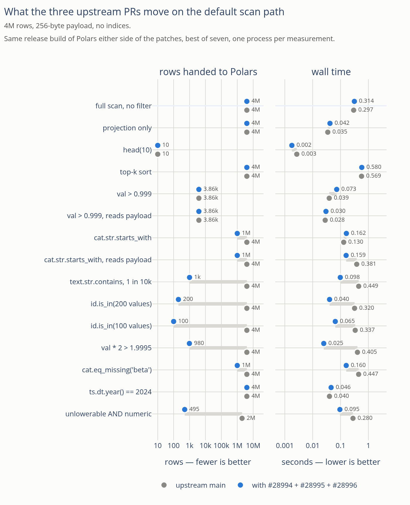
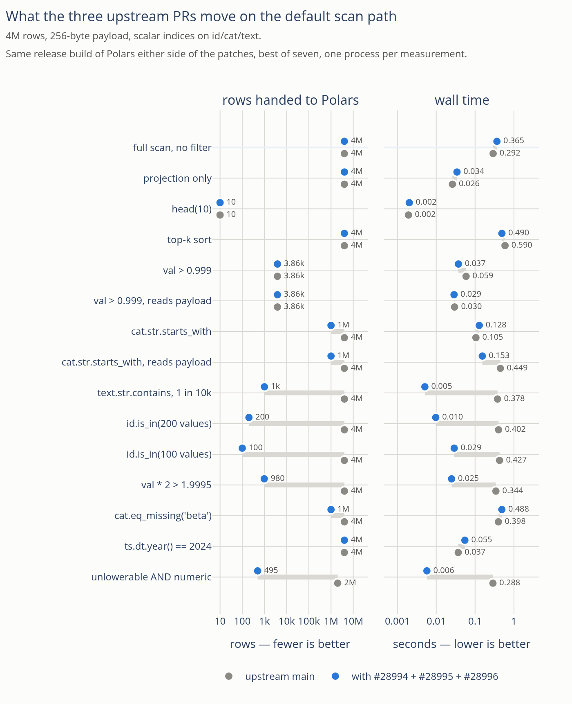
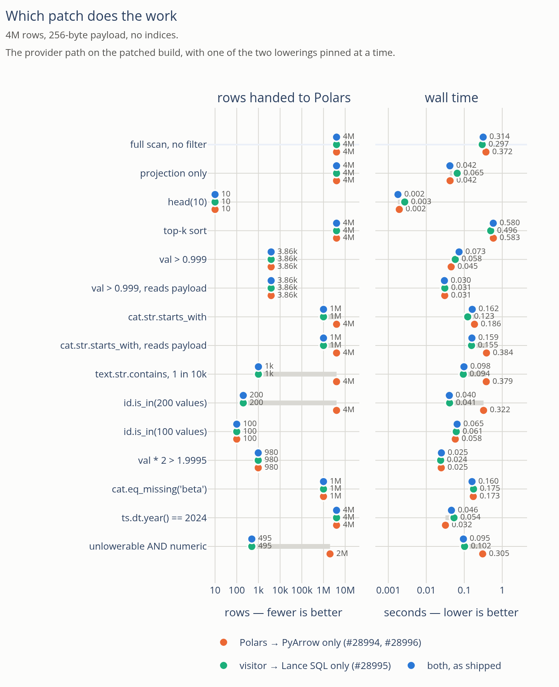
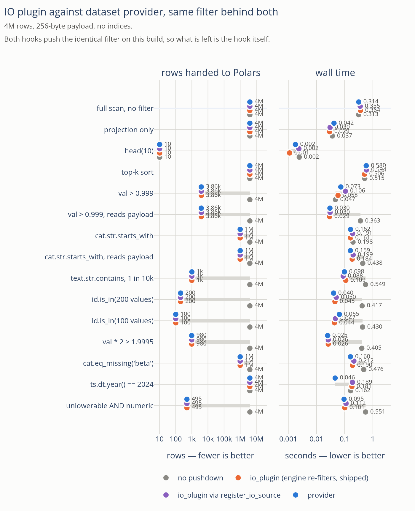

# Predicate pushdown on a patched Polars

[`PREDICATE_PUSHDOWN.md`](PREDICATE_PUSHDOWN.md) ends on a hypothesis: the split
between the two scan paths is not fundamental, and a Polars that handed the
dataset provider its *predicate* rather than one lowering of it would collapse
the choice. Three upstream branches now exist, so this measures them.

| PR | what it changes | who it reaches |
| --- | --- | --- |
| [#28994](https://github.com/pola-rs/polars/pull/28994) | repairs `predicate_to_pa`: `is_in` lowered nothing, `eq_missing` emitted `==v`, `xor` emitted `^` | every dataset provider, `scan_delta`, `scan_iceberg` |
| [#28996](https://github.com/pola-rs/polars/pull/28996) | lowers `+ - * /` into the PyArrow predicate | same |
| [#28995](https://github.com/pola-rs/polars/pull/28995) | passes `serialized_predicate` — the whole predicate — to a provider that accepts it | dataset providers only |

The first two widen what Polars can say in PyArrow. The third lets a source say
it in its own language instead. Both matter here: this package lowers Polars
predicates into Lance SQL (`_predicate.to_lance_filter`), which is wider than
PyArrow, but before #28995 it could only do that on the IO-plugin path.

**In one paragraph.** On the default scan path the patches are worth **2x to
16x** on filters Polars could not lower before, **up to 74x** once the dataset
carries a scalar index, and nothing at all on the rest — 12 of 47 predicate
shapes reach Lance before, 17 after, and #28995 puts the remaining 18 within
reach too. They also fix a **wrong answer**: a naive-timestamp comparison,
pushed as a PyArrow expression, made Lance return zero rows (§6.1). With the
same filter behind both hooks, the provider path is level with the IO plugin
except on one shape, where it is 4x ahead for a reason that is upstream and
named in a `TODO` (§5).

## 1. Method

Two wheels from one checkout, so nothing but the patches differs:

| | commit |
| --- | --- |
| `base` | `73dd5be`, upstream `main` — the common parent of all three branches |
| `patched` | `cfb07e1` = `73dd5be` + #28994 + #28996 + #28995, cherry-picked clean |

Both are **release builds** — `--profile nodebug-release`, which inherits
`release` (opt-level 3, thin LTO) and only drops the debug symbols. Both report
`2.0.0-rc.1`. Each wheel goes into its own venv with pylance 9.0.0, pyarrow
25.0.0 and this package installed from the same working tree. The earlier
investigation's §8 measured a locally built Polars whose profile is not
recorded; everything here is release on both sides.

The matrix is `bench/pushdown.py`: 4M rows with a 256-byte payload column
(1.05 GiB), **best of seven**, one process per measurement, and a second run
over a copy carrying BTREE/BITMAP/NGRAM scalar indices. Every case cross-checks
its result across all paths. The dataset lives on NVMe, not the tmpfs `/tmp` is
on this machine.

Two cautions about reading the tables:

- **The rows column is the mechanism; the seconds follow from it.** Row counts
  are exactly reproducible — across two full repeat runs, all 300 paired
  measurements agreed.
- **Below ~100 ms, treat differences as noise.** Those same two runs had a
  median wall-time ratio of 0.996, but individual small cases (`proj`, `head`)
  moved by up to 30%. Only the large gaps carry weight.

Machine: 8-core Intel Core Ultra 7 258V, 30 GiB, local NVMe, Linux 7.2. The
numbers are ratios between paths on one machine, not absolute throughput.
`bench/results-rel-*.jsonl` holds every measurement.

## 2. Coverage: 12 of 47 becomes 17 of 47

`bench/coverage.py` runs both lowerings over 47 predicate shapes. It now grades
*both* the way it used to grade only the visitor's — build the filter, hand it to
Lance, compare the row set against the predicate evaluated eagerly — rather than
inspecting the shape of the generated string. That change is what turned up the
defects in §6.

| shape | `base` | `patched` |
| --- | --- | --- |
| `is_in`, list or Series, ≤ 100 elements | – | **yes** |
| `is_in`, > 100 elements | – | – |
| `eq_missing` | `SyntaxError` | **yes** |
| `xor` | `TypeError` | – (declines) |
| arithmetic `+ - *` | – | **yes** |
| arithmetic `/` | – | **Lance refuses to plan it** (§6.2) |
| `datetime` literal comparison | wrong rows | wrong rows (§6.1) |
| comparisons, boolean structure, `is_null`, `is_between`, `all_horizontal`, column-vs-column, `date` literal | yes | yes |
| every string function, `%`, `abs`, temporal parts, `cast`, list, struct, `fill_null`, `is_nan` | – | – |

**12 of 47 before, 17 of 47 after.** The visitor stays at 35 of 47, so #28995 —
which is what lets the provider path use the visitor at all — is still the
largest of the three by coverage. What #28994 and #28996 buy is that their five
shapes reach Lance *without* a visitor, which is what `scan_delta` and
`scan_iceberg` need.

Two details set what the benchmark can show:

- **`is_in` is capped at 100 elements.** `LIST_ITEM_LIMIT` in `pyarrow.rs`
  refuses to render a longer haystack into the predicate string. The cap is
  older than #28994 and untouched by it, so `id.is_in(200 values)` stays
  invisible to the PyArrow lowering while `id.is_in(100 values)` does not. The
  matrix carries both sizes, and §4 shows them landing on opposite sides.
- **`xor` now declines rather than emitting `^`.** #28994 lowers it as
  `(l | r) & ~(l & r)`, but only when both operands are *known* boolean without
  consulting the schema; a bare boolean column is not, so `(a > 5) ^ flag` falls
  back. Declining beats the `TypeError` it used to emit.

## 3. What became faster

`impl="provider"`, the default path, on the two builds. Wall time / rows Lance
handed to Polars.



| case | `base` | `patched` | |
| --- | --- | --- | --- |
| `val * 2 > 1.9995` | 0.405 s / 4,000,000 | 0.025 s / 980 | **16.2x** |
| `id.is_in(200)` | 0.320 s / 4,000,000 | 0.040 s / 200 | **7.9x** |
| `id.is_in(100)` | 0.337 s / 4,000,000 | 0.065 s / 100 | **5.2x** |
| `text.str.contains`, 1 in 10k | 0.449 s / 4,000,000 | 0.098 s / 1,000 | **4.6x** |
| unlowerable `AND` numeric | 0.280 s / 2,000,341 | 0.095 s / 495 | **3.0x** |
| `cat.eq_missing('beta')` | 0.447 s / 4,000,000 | 0.160 s / 1,000,000 | **2.8x** |
| `cat.str.starts_with`, reads payload | 0.381 s / 4,000,000 | 0.159 s / 1,000,000 | **2.4x** |
| `cat.str.starts_with`, narrow | 0.130 s / 4,000,000 | 0.162 s / 1,000,000 | 1.2x slower |
| `ts.dt.year() == 2024` (matches all) | 0.040 s / 4,000,000 | 0.046 s / 4,000,000 | par |
| full scan, projection, `head`, top-k, `val > 0.999` | — | — | par |

The two rows that get *slower* are the two where pushing cannot pay: `cat` has
to be read either way, so a `starts_with` on a narrow projection buys nothing
and costs the filter, and `dt.year() == 2024` matches every row.

### With scalar indices

An index does not change the size of the win so much as its kind: a predicate
that never reaches Lance cannot use an index however good the index is.



| case | `base` | `patched` | |
| --- | --- | --- | --- |
| `text.str.contains`, 1 in 10k (NGRAM) | 0.378 s / 4,000,000 | 0.005 s / 1,000 | **74.2x** |
| unlowerable `AND` numeric | 0.288 s / 2,000,341 | 0.006 s / 495 | **50.1x** |
| `id.is_in(200)` (BTREE) | 0.402 s / 4,000,000 | 0.010 s / 200 | **41.4x** |
| `id.is_in(100)` (BTREE) | 0.427 s / 4,000,000 | 0.029 s / 100 | **14.7x** |
| `val * 2 > 1.9995` | 0.344 s / 4,000,000 | 0.025 s / 980 | **13.8x** |
| `cat.str.starts_with`, reads payload | 0.449 s / 4,000,000 | 0.153 s / 1,000,000 | **2.9x** |
| `cat.eq_missing('beta')` (BITMAP) | 0.398 s / 4,000,000 | 0.488 s / 1,000,000 | 1.2x slower |

`eq_missing` is the counter-example worth keeping: 25% of rows match, the query
reads the payload, and late-materialising a million 256-byte payloads through
the BITMAP index costs more than reading them in order. Pushing a filter is not
free, and a quarter-selective predicate over a wide row is where it stops paying.

## 4. Which patch does the work

`provider_pa` and `provider_sql` pin the provider path to one of the two
predicates Polars hands it, which separates the PyArrow-side changes (#28994,
#28996) from the serialized predicate (#28995). Rows out of Lance in brackets.



| case | `base` | PyArrow only | Lance SQL only | shipped |
| --- | --- | --- | --- | --- |
| `id.is_in(100)` | 0.337 s (4M) | **0.058 s (100)** | 0.061 s (100) | 0.065 s (100) |
| `val * 2 > 1.9995` | 0.405 s (4M) | **0.025 s (980)** | 0.024 s (980) | 0.025 s (980) |
| `cat.eq_missing('beta')` | 0.447 s (4M) | **0.173 s (1M)** | 0.175 s (1M) | 0.160 s (1M) |
| `id.is_in(200)` | 0.320 s (4M) | 0.322 s (4M) | **0.041 s (200)** | 0.040 s (200) |
| `text.str.contains` | 0.449 s (4M) | 0.379 s (4M) | **0.094 s (1,000)** | 0.098 s (1,000) |
| `cat.str.starts_with`, payload | 0.381 s (4M) | 0.384 s (4M) | **0.155 s (1M)** | 0.159 s (1M) |
| unlowerable `AND` numeric | 0.280 s (2M) | 0.305 s (2M) | **0.102 s (495)** | 0.095 s (495) |

Clean split, and the two halves do not overlap:

- **#28994 and #28996 carry `is_in` under the cap, arithmetic and
  `eq_missing`** — and carry them as well as the visitor does. Where both can
  express a predicate, the PyArrow expression and the Lance SQL string cost the
  same; the choice between them is about coverage, not speed.
- **#28995 carries everything else** — every string function, `is_in` over the
  100-element cap, and any conjunction with an unlowerable half.

Neither subsumes the other, which is the argument for all three.

## 5. IO plugin against dataset provider

On the patched build both hooks push the identical filter — the row counts are
equal in every case — so what remains is the hook. `cores` is CPU time over wall
time: how much of an 8-core machine the query used.



| case | rows out of Lance | `provider` | `io_plugin` | `io_plugin_register` |
| --- | --- | --- | --- | --- |
| `ts.dt.year() == 2024` | 4,000,000 | **0.046 s / 2.2 cores** | 0.181 s / 0.9 | 0.189 s / 0.9 |
| `cat.str.starts_with`, payload | 1,000,000 | **0.159 s / 3.8** | 0.184 s / 3.7 | 0.199 s / 3.5 |
| `cat.eq_missing('beta')` | 1,000,000 | **0.160 s / 3.8** | 0.190 s / 3.6 | 0.212 s / 3.5 |
| `val > 0.999` | 3,861 | 0.073 s / 1.0 | **0.058 s / 1.0** | 0.106 s / 0.9 |
| `id.is_in(100)` | 100 | 0.065 s / 1.0 | **0.044 s / 1.0** | 0.047 s / 1.0 |
| `text.str.contains` | 1,000 | 0.098 s / 1.0 | 0.109 s / 1.0 | **0.088 s / 1.0** |
| full scan, `head`, projection, top-k | — | par | par | par |

**The one real gap is `dt.year()`, and it is a parallelism gap.** The provider
path runs at 2.2 cores, the IO plugin at 0.9 — single-threaded. It is not the
hook's overhead and not the Python boundary: a Python-source scan evaluates the
residual predicate *inside its own scan node*, on one thread, while a
provider-resolved scan gets an ordinary parallel `FilterNode` above it. Upstream
says as much in `crates/polars-stream/src/physical_plan/to_graph.rs`:

```rust
// TODO: Move this to a FilterNode so that it happens in parallel. We may need
// to move all of the enclosing code to `lower_ir` for this.
if let (Some(pred), false) = (&pl_predicate, can_parse_predicate) {
```

That predicts the shape exactly: the gap is invisible when the filter is
selective (little left to re-check) and grows to ~4x when nearly every row
survives *and* the predicate is not free. `dt.year()` on 4M rows is both.

Two hypotheses ruled out along the way:

- **Not batch size.** Both paths get 160 batches of 25,000.
- **Not the projection**, though it does differ. For a
  `filter(...).select(pl.len())` query the provider is asked for `['ts']` and
  the IO plugin for `['id', 'ts']` — an extra column, systematically, on every
  such query. But scanning that extra column costs nothing in Lance (26.6 ms
  against 29.5 ms over 4M rows), so it does not explain the 135 ms.

### `register_io_source` is a third of the remaining gap

`io_plugin_register` is the previous implementation of `impl="io_plugin"`, kept
as a column. `polars.io.plugins.register_io_source` hardcodes "the source
applied the predicate", so a source pushing a *relaxed* filter has to re-apply
the predicate itself, per batch, from Python. Reporting it unapplied instead —
which needs `_scan_python_function` directly — hands that evaluation to the
engine. Over the identical pushed filter, best of fifteen:

| case | rows out | `io_plugin` | `io_plugin_register` |
| --- | --- | --- | --- |
| `val > 0.999` | 3,861 | **0.039 s** | 0.104 s |
| `cat.eq_missing('beta')` | 1,000,000 | **0.171 s** | 0.211 s |
| `cat.str.starts_with` | 1,000,000 | **0.172 s** | 0.196 s |
| `cat.str.starts_with`, payload | 1,000,000 | **0.172 s** | 0.181 s |
| `text.str.contains` | 1,000 | **0.094 s** | 0.099 s |
| `ts.dt.year() == 2024` | 4,000,000 | 0.182 s | **0.175 s** |

It also serializes smaller — 2.8 kB against 4.2 kB — because the closure is
simpler than the wrapper's. `scan_lance(..., impl="io_plugin")` now does this;
it costs one more private Polars API, the same trade the provider path already
documents.

### Per query rather than per row

`bench/hooks.py`, 10,000 rows, 200 collects, so everything is fixed cost:

| path | ms/collect, plan kept | ms/collect, fresh plan | serialized plan | resolves/collect | of which re-resolve |
| --- | --- | --- | --- | --- | --- |
| `provider` | 4.88 | 7.12 | **1,611 B** | 2.00 | 1.00 |
| `io_plugin` | **3.65** | **4.89** | 2,768 B | 0 | 0 |
| `io_plugin_register` | 4.29 | 5.36 | 4,201 B | 0 | 0 |

The provider hook's resolved-scan cache is real but partial: `to_dataset_scan`
is still called twice per collect, and one of those two is a full re-resolution
rather than a version-key hit. Against that, its plan is the smallest, which is
what matters for Polars Cloud.

`hooks.py` also probes the two "did you apply the predicate?" flags, and reports
them on every run:

- **A provider-resolved scan's `predicate_applied` is ignored.** A scan that
  hands back all ten rows while claiming the predicate is applied still yields
  five. Confirmed on 2.0.0-rc.1, as `PREDICATE_PUSHDOWN.md` §1 found on 1.44. It
  is why there is no `provider_exact` variant: the flag cannot be honoured, so
  any filter pushed into Lance is an IO hint and never the source of truth.
- **An IO plugin reporting the predicate *unapplied* is believed**, and the
  engine re-applies it. That is what the change above rests on.

## 6. Three defects the stricter coverage check found

Grading a lowering by running it against the data, rather than by reading the
string it produced, turned up three things the shape check could not see.

### 6.1 Lance answers a PyArrow timestamp filter with the wrong rows

Not Polars' lowering and not the visitor's. Lance takes a PyArrow expression
through Substrait, and a comparison against a **timezone-naive timestamp**
column comes back with every row or none of them:

```python
ds = lance.dataset(uri)                        # ts: timestamp[us], 100 rows
cut = datetime(2024, 1, 3, 2)
ds.scanner(filter=pc.field("ts") > pa.scalar(cut, pa.timestamp("us")))  # 0 rows
ds.scanner(filter="ts > timestamp '2024-01-03 02:00:00'")               # 49, right
```

| unit | `>` | `<` | `==` |
| --- | --- | --- | --- |
| `timestamp[s]`, `timestamp[ms]` | 0 | every row | 0 |
| `timestamp[us]` | 0 | 0 | 0 |
| `timestamp[ns]` | `ArrowNotImplementedError` | | |

PyArrow evaluates the same expression correctly, so the expression is fine and
the Substrait round trip is not. Reproduced on pylance 9.0.0 and 10.0.0.

It reached users of this package: `scan_lance(uri).filter(pl.col("ts") > x)` on
the default path returned **0 rows instead of 1,903**, because the pushed filter
removed everything and Polars' own re-application then had nothing left. Every
other type this package can push is either right (`date32`, numbers, strings) or
*loudly* wrong — `date64`, `time64`, `duration` and a timestamp carrying a time
zone all raise, which `iter_frames` catches, warns about and scans without. Only
the naive timestamp is silent.

`_scan._unsafe_for_lance` now refuses to push a PyArrow predicate naming a
naive-timestamp column, with a test that fails when Lance repairs it. The
visitor's SQL is unaffected, so on a Polars carrying #28995 the same predicate is
pushed *correctly* rather than not at all: the patch turns a wrong answer into a
fast one.

### 6.2 #28996's `/` lowering does not survive Substrait

`(pl.col("id") / 2) > 10.5` lowers to

```python
(((pa.compute.field('id')).cast('double') / 2) > 10.5)
```

The cast is there for a good reason — Polars' `/` is float division, PyArrow's
follows the operand types — but it is a *safe* cast, and Lance answers with
`ArrowInvalid: Substrait is only capable of representing unsafe casts`. This
package drops the filter with a warning and scans unfiltered, so results stay
correct and only the pushdown is lost.

That is a Lance-side limit rather than a mistake in the PR: `scan_delta` hands
the expression straight to PyArrow, which is happy with a safe cast. It is worth
knowing for #28996 that the one operator needing a cast is the one operator a
Substrait consumer cannot take.

### 6.3 A `CAST` costs Lance its scalar index

This one was ours. Comparing a column to a float literal has to promote the
column, because Lance rejects the mixed comparison Polars would allow — but the
visitor sees only the expression, so it could not tell an integer column from
one already `Float64`, and promoted both. Against the 4M-row dataset with a
BTREE index on `id`:

| filter | |
| --- | --- |
| `id > 3999000` | 1.5 ms |
| `CAST(id AS double) > 3999000.0` | **12.2 ms** |
| `id IN (100 values)` | 3.2 ms |
| `CAST(id AS double) IN (100 floats)` | **46.2 ms** |

`to_lance_filter` now takes an optional `schema` and uses it for exactly one
thing: dropping a promotion the schema shows is a no-op. Both call sites have
the schema already.

## 7. What this changes here

| change | why |
| --- | --- |
| `_unsafe_for_lance` refuses a PyArrow filter over a naive-timestamp column | §6.1 — it was returning wrong rows |
| `to_lance_filter(..., schema=)` drops a promotion the schema shows is a no-op | §6.3 — a `CAST` costs Lance its scalar index |
| `impl="io_plugin"` reports the predicate unapplied, so the engine re-applies it | §5 — `register_io_source` forces a per-batch Python filter |
| the matrix runs per (Polars build × dataset), one mechanism per column | so a difference names a cause |

And for the two scan paths:

- **`impl="provider"` stays the default**, and on a patched Polars it stops
  being a compromise: it receives both lowerings, so it pushes everything the
  IO-plugin path pushes, and it is level-to-ahead on time.
- **`impl="io_plugin"` remains the only path with the visitor on a stock
  Polars**, which is every installation today, so it stays. If #28995 lands it
  becomes redundant rather than wrong.
- **The three PRs are worth having independently of this package.** #28994 and
  #28996 widen what every dataset provider receives, including `scan_delta` and
  `scan_iceberg`, which have no visitor to fall back on.

## Reproducing

```sh
# two release wheels from one checkout
git -C polars checkout 73dd5be                       # base
maturin build -m py-polars/runtime/polars-runtime-32/Cargo.toml \
    --features backtrace_filter --profile nodebug-release -o dist-base
git -C polars checkout cfb07e1                       # + #28994 + #28996 + #28995
maturin build ... -o dist-patched

export BENCH_ROOT=/var/tmp BENCH_ROWS=4000000 BENCH_REPEATS=7
uv run bench/pushdown.py gen
BENCH_BUILD=base BENCH_IMPLS=provider,io_plugin,io_plugin_register,engine \
    venv-base/bin/python bench/pushdown.py run --json bench/results-rel-base-4m.jsonl
BENCH_BUILD=patched \
    BENCH_IMPLS=provider,provider_pa,provider_sql,io_plugin,io_plugin_register,engine \
    venv-patched/bin/python bench/pushdown.py run --json bench/results-rel-patched-4m.jsonl

uv run bench/coverage.py --json bench/results-rel-coverage-patched.jsonl   # §2
uv run bench/hooks.py --json bench/results-rel-hooks-patched.jsonl         # §5
uv run --group bench bench/plot_patched.py --static                        # the figures
```
