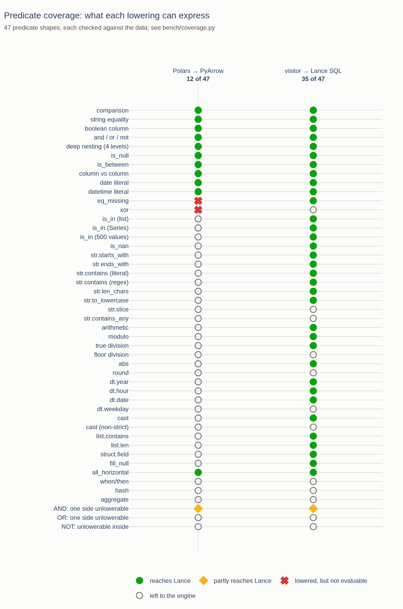
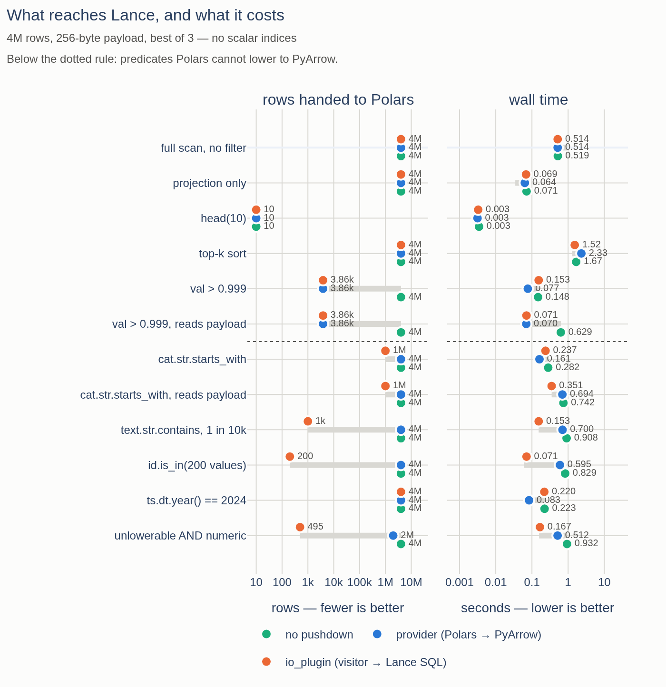
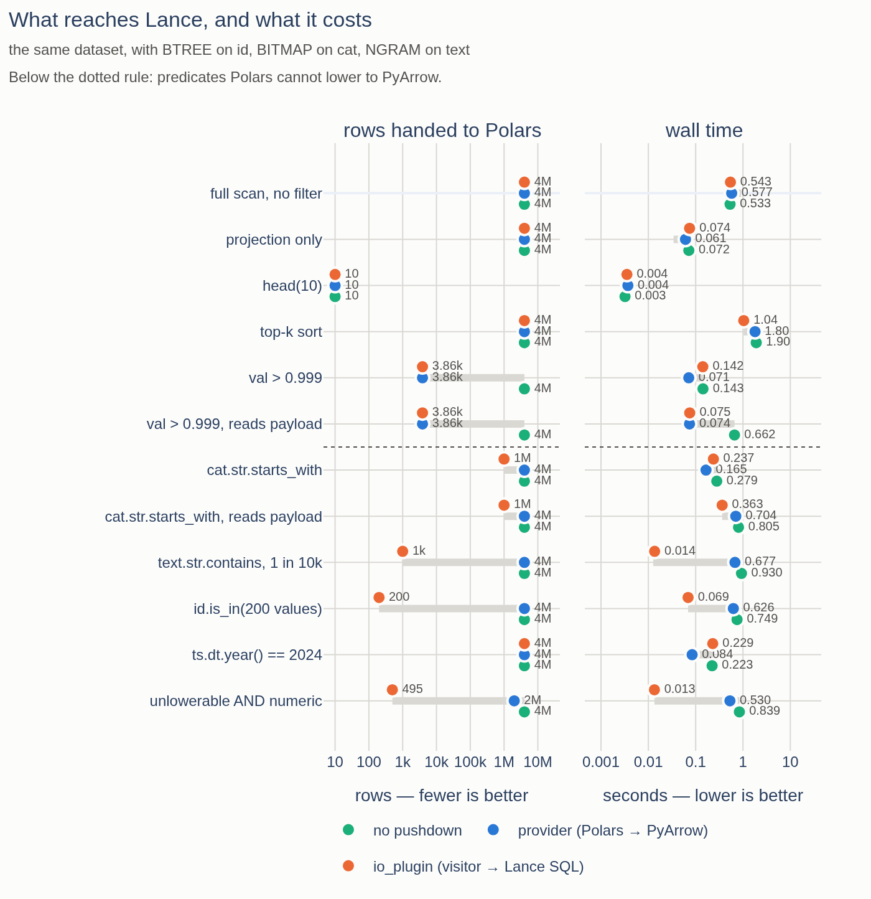
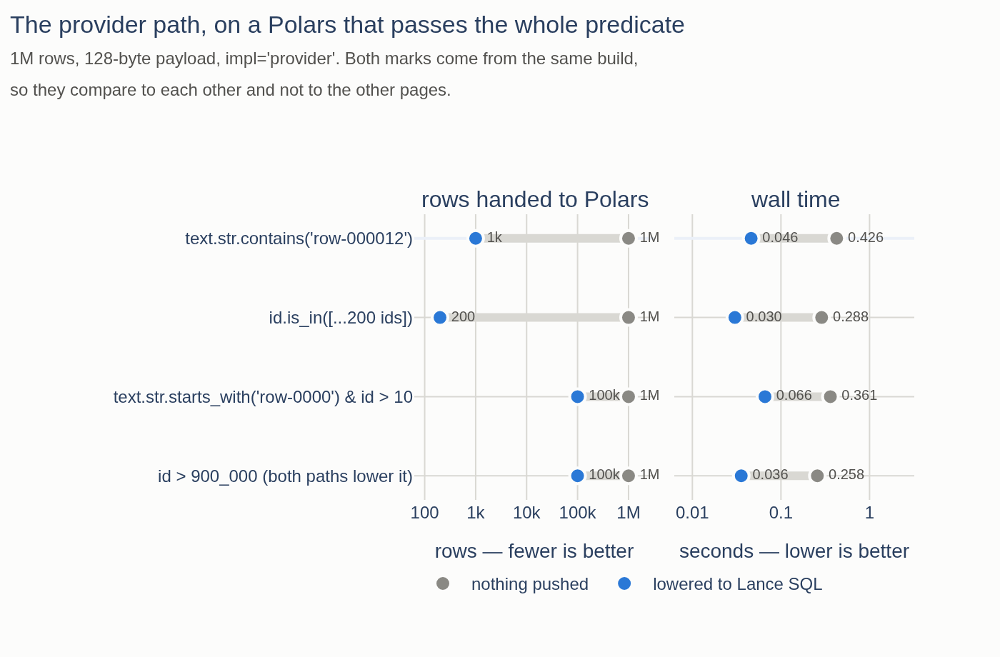
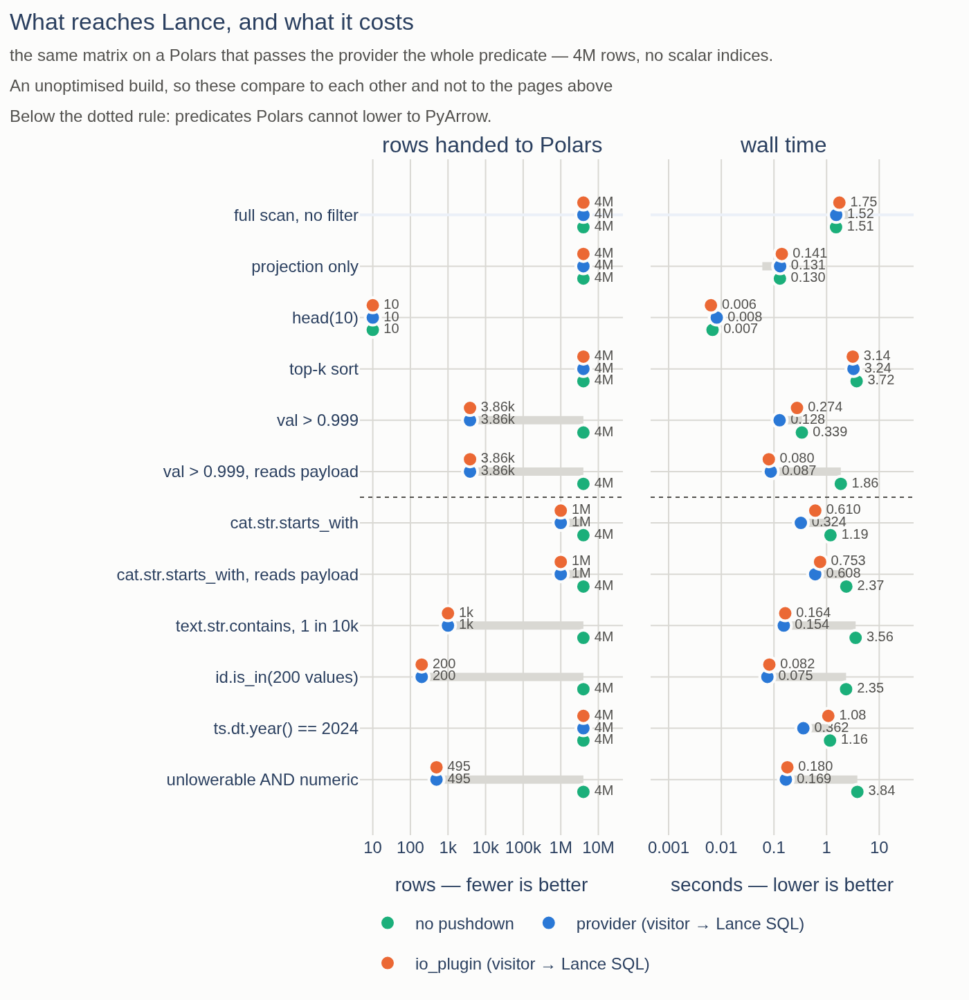

# Predicate pushdown: what actually reaches Lance

Ritchie Vink, on [pola-rs/polars#12389](https://github.com/pola-rs/polars/issues/12389#issuecomment-5410366229):

> Note that with a visitor over expressions it is possible to lower the
> predicates earlier (e.g. not on pre-loaded batches).

This is the investigation of whether that is worth doing here, given that
`scan_lance` already runs on the dataset-provider hook, which hands over a
predicate Polars has *already* lowered. Short version:

- Polars' own lowering is narrow. Of 47 predicate shapes, **12 reach Lance
  through the provider path and 35 through a visitor** — `is_in`, every string
  function, arithmetic, temporal parts, list and struct access are all left to
  the engine today.
- The visitor cannot be bolted onto the provider hook as Polars ships today.
  The hook never sees a Polars expression, and the three ways of smuggling one
  in all fail. Using it means using the IO-plugin hook, as suspected — §8 is
  the 113-line upstream change that removes the trade-off, built and measured.
  With it the provider path pushes the identical filter, so the choice
  disappears.

> **Superseded in part.** §8's head-to-head was run against a locally built
> Polars whose build profile is not recorded, and its "1.2x to 3x faster than
> the IO-plugin path" does not survive a release build on both sides. With
> release builds the two are level except on one shape, and a third of the gap
> that remained was this package's own use of `register_io_source` rather than
> the hook. [`PATCHED_POLARS_PUSHDOWN.md`](PATCHED_POLARS_PUSHDOWN.md) is the
> re-measurement, and also covers the two PyArrow-lowering PRs this document
> predates.
- It pays where you would expect: **2x to 8x** on filters Polars cannot lower,
  and **up to 48x** once the dataset has a scalar index, which is unreachable
  otherwise. It is level-to-slightly-negative everywhere else.

Both paths now ship: `scan_lance(..., impl="provider")` (default) and
`scan_lance(..., impl="io_plugin")`.

## 1. What the provider hook actually hands over

`to_dataset_scan()` is called with five keyword arguments and no others:
`existing_resolved_version_key`, `limit`, `projection`, `filter_columns` and
`pyarrow_predicate`. The last is a *string of Python source* that Polars
generated from its own IR, e.g. `"(pa.compute.field('cat') == 'b')"`, evaluated
against a fixed namespace. There is no route to the Polars expression itself.

Three further facts, all measured on polars 1.44.0, shape everything below:

- **Polars re-applies the predicate regardless.** The `(frames, predicate_applied)`
  flag a provider-returned scan reports back is ignored: a scan that filters
  nothing while claiming `True` still produces correctly filtered results, on
  both the streaming and in-memory engines. It has to be that way — see the next
  point — and it means *any* filter pushed into Lance is an IO hint, never the
  source of truth. This package now reports `False`, which is the reading that
  stays correct if a future Polars starts honouring the flag.
- **Polars already lowers partially.** Given
  `cat.str.starts_with("b") & (id > 5)` it sends `(pa.compute.field('id') > 5)`
  and drops the rest. So "lower what you can, keep the predicate above the scan"
  is upstream behaviour, not an invention of this package.
- **The scan callable gets no second chance.** The `LazyFrame` returned from
  `to_dataset_scan` is invoked with *no arguments at all* — projection, limit
  and filter were resolved before it was built.

## 2. Coverage: what Polars can and cannot lower

Polars' lowering lives in `crates/polars-plan/src/plans/python/pyarrow.rs`. It
handles comparisons, boolean structure, `is_null`/`is_not_null`, `is_between`,
column-vs-column comparison, `eq_missing`, and literals of bool/int/float/str/
date/datetime/duration. Everything else returns `None` — and one unlowerable
node in a disjunction discards the whole predicate.

`bench/coverage.py` runs both lowerings side by side over 47 predicate shapes
and checks each result against the data. Where they differ:

| | Polars → PyArrow | visitor → Lance SQL |
| --- | --- | --- |
| `is_in`, list or Series | – | `id IN (1, 2, 3)` |
| `str.starts_with` / `ends_with` | – | `starts_with(cat, 'be')` |
| `str.contains`, literal | – | `contains(text, 'gamma')` |
| `str.contains`, regex | – | `regexp_like(text, 'row-\d+')` |
| `str.len_chars`, `to_lowercase`, … | – | `length(cat)`, `lower(cat)` |
| arithmetic, `%`, `/`, `abs`, unary `-` | – | `((id + 1) * 2) > 100` |
| `dt.year` / `month` / `hour` / `date` | – | `date_part('year', ts) = 2024` |
| `cast` (strict) | – | `CAST(id AS int) > 5` |
| `list.contains`, `list.len` | – | `array_has(tags, 3)` |
| `struct.field` | – | `` meta.`k` > 5 `` |
| `fill_null` | – | `coalesce(opt, 0) > 5` |
| `is_nan` | – | `val != val` |
| comparisons, `and`/`or`/`not`, nesting | ✓ | ✓ |
| `is_null`, `is_between`, `eq_missing` | ✓ | ✓ |
| `xor` | ✓ | – (Lance rejects boolean operands to `!=`) |
| `when/then`, `hash`, aggregates, `str.slice`, `dt.weekday`, `round`, `//` | – | – |

12 of 47 reach Lance through the provider path, 35 through the visitor. Two
more (`eq_missing` and `xor`) are lowered by Polars into strings that cannot be
evaluated at all; see §6.



## 3. Why the visitor needs the IO plugin

The obvious wish is to keep the provider hook and lower the predicate ourselves.
There is no way to do it in polars 1.44:

| attempt | result |
| --- | --- |
| read the predicate from `to_dataset_scan` | only the PyArrow string exists |
| let the returned scan callable receive it | called with no arguments |
| return an IO-plugin `LazyFrame` from the hook | `PanicException: not yet implemented: IOPlugin` |
| return anything else (e.g. a `select` over one) | `ComputeError: unknown DSL when resolving python dataset scan` |

So the answer to "does the IO Plugin mechanism have to be used again" is yes,
for a stock Polars — it is the only hook that hands over a `pl.Expr`. The fix is
upstream and small, and §8 has it built and measured.

## 4. The visitor

`src/polars_pylance/_predicate.py`. `to_lance_filter(expr)` walks
`expr.meta.serialize(format="json")` and returns a `LanceFilter(sql, exact)` or
`None`.

Two design points carry it:

**Relaxation.** A lowering may return a *superset* filter. An unlowerable
conjunct of an `AND` is dropped, so
`text.str.contains(...) & (val > 0.5) & tricky(...)` still pushes the first two.
That is only sound in positive position: a dropped branch of an `OR`, or a
relaxed child under a `NOT`, would remove rows, and both decline instead. The
`exact` flag records which happened. Since Polars re-applies the predicate
anyway (§1), a superset filter is always safe — it costs IO, never rows.

**Literals via round-trip.** A literal subtree is deserialized back into a
`pl.Expr` and evaluated, rather than decoded out of the IR by hand. The IR
spells literals as a dtype-dependent mix of inline values and Arrow IPC blobs
and has changed spelling between releases; the round trip is immune to that and
yields a typed `Series` to render from.

Where SQL and Polars disagree the lowering declines rather than guesses:
`round` (Polars breaks ties to even, Lance away from zero), `dt.weekday`
(1..7 vs 0..6), `//`, non-strict casts, `Time`/`Duration` literals, `xor`, and
anything not on the allowlist. Two coercions are applied rather than declined:
a float literal against an integer column casts the column (Lance refuses the
mixed comparison Polars promotes), and `/` casts its left operand (Polars' `/`
is float division, SQL's is integer division between integers).

Correctness is checked two ways, both in `tests/test_predicate.py`: 40 shape
tests pinning one construct each and 16 pinning what is refused, and a
differential test that runs the predicate and its lowering against a real
dataset and asserts the row set is a superset — including 120 randomly generated trees up to 4 levels deep, built
from leaves that deliberately include unlowerable ones. Anything Lance still
refuses to plan is caught at scan time, warned about, and dropped.

## 5. Does it pay?

`bench/pushdown.py`, 4M rows with a 256-byte payload column (1.05 GiB), best of
three, one process per measurement. `engine` is the IO-plugin path with
`predicate_pushdown=False`, i.e. the same hook doing no lowering at all, which
separates the translator's contribution from the hook's.

Each cell is wall time / peak RSS / rows Lance handed to Polars. The `rows`
panel is the mechanism; the timings follow from it.



### Without scalar indices

| case | provider | io_plugin | engine (no lowering) |
| --- | --- | --- | --- |
| full scan, no filter | 0.514 s / 514 MiB / 4,000,000 | 0.514 s / 520 MiB / 4,000,000 | 0.519 s / 526 MiB / 4,000,000 |
| projection only | 0.064 s / 286 MiB / 4,000,000 | 0.069 s / 282 MiB / 4,000,000 | 0.071 s / 285 MiB / 4,000,000 |
| `head(10)` | 0.003 s / 268 MiB / 10 | 0.003 s / 266 MiB / 10 | 0.003 s / 266 MiB / 10 |
| top-k sort | 2.325 s / 2408 MiB / 4,000,000 | 1.523 s / 2559 MiB / 4,000,000 | 1.669 s / 2642 MiB / 4,000,000 |
| `val > 0.999` | 0.077 s / 296 MiB / 3,861 | 0.153 s / 304 MiB / 3,861 | 0.148 s / 301 MiB / 4,000,000 |
| `val > 0.999`, reads payload | 0.070 s / 346 MiB / 3,861 | 0.071 s / 339 MiB / 3,861 | 0.629 s / 524 MiB / 4,000,000 |
| `cat.str.starts_with` | 0.161 s / 285 MiB / 4,000,000 | 0.237 s / 301 MiB / 1,000,000 | 0.282 s / 298 MiB / 4,000,000 |
| `cat.str.starts_with`, reads payload | 0.694 s / 600 MiB / 4,000,000 | **0.351 s** / 609 MiB / 1,000,000 | 0.742 s / 552 MiB / 4,000,000 |
| `text.str.contains`, 1 in 10k | 0.700 s / 579 MiB / 4,000,000 | **0.153 s** / 308 MiB / 1,000 | 0.908 s / 558 MiB / 4,000,000 |
| `id.is_in(200 values)` | 0.595 s / 616 MiB / 4,000,000 | **0.071 s** / 310 MiB / 200 | 0.829 s / 504 MiB / 4,000,000 |
| `ts.dt.year() == 2024` (matches all) | 0.083 s / 293 MiB / 4,000,000 | 0.220 s / 307 MiB / 4,000,000 | 0.223 s / 294 MiB / 4,000,000 |
| unlowerable `AND` numeric | 0.512 s / 831 MiB / 2,000,341 | **0.167 s** / 327 MiB / 495 | 0.932 s / 592 MiB / 4,000,000 |

### With scalar indices (BTREE on `id`, BITMAP on `cat`, NGRAM on `text`)



Only the rows that change materially:

| case | provider | io_plugin |
| --- | --- | --- |
| `text.str.contains`, 1 in 10k | 0.677 s / 536 MiB / 4,000,000 | **0.014 s** / 301 MiB / 1,000 |
| unlowerable `AND` numeric | 0.530 s / 838 MiB / 2,000,341 | **0.013 s** / 307 MiB / 495 |
| `id.is_in(200 values)` | 0.626 s / 599 MiB / 4,000,000 | **0.069 s** / 315 MiB / 200 |
| `cat.str.starts_with` | 0.165 s / 286 MiB / 4,000,000 | 0.237 s / 303 MiB / 1,000,000 |

An index changes the kind of win rather than its size: `contains` goes from 4.6x
to **48x**, because the NGRAM index turns the scan into a lookup — but only for a
query that reaches Lance at all. A predicate Polars declines to lower cannot use
an index no matter how good the index is. (The BITMAP index on `cat` does
nothing for `starts_with`; it serves equality, not prefixes.)

### Reading the numbers

- **The rows column is the mechanism.** `is_in` moves 4,000,000 rows to Polars
  on the provider path and 200 on the IO-plugin path. Everything else follows
  from that.
- **Pushing only pays if it saves IO.** `starts_with` on a narrow projection is
  *slower* pushed (0.237 vs 0.161): Lance has to read `cat` either way, and the
  filter costs more than the four bytes per row it saves. The same predicate
  with the payload column in the projection is 2x faster, because late
  materialisation then skips 3M payloads. `dt.year() == 2024` matching every row
  is the pure-overhead case, and costs 0.14 s.
- **The IO-plugin hook costs about 0.07 s per 4M rows** on a filtered narrow
  scan (`val > 0.999`: 0.077 vs 0.153, with identical rows moved). Full scans,
  `head()` and projections are level; top-k came out faster, though it is the
  noisiest case in the set.
- **The `head()` gap in [`PRIVATE_HOOK_VS_IO_PLUGIN.md`](PRIVATE_HOOK_VS_IO_PLUGIN.md)
  was an implementation artefact.** That document measured an IO plugin that
  never passed `n_rows` to Lance and re-applied the predicate in Python. Polars
  does hand the plugin `n_rows` (whenever no filter sits above the scan, which
  is the same rule the provider path gets), and passing it through closes the
  5.5x gap to nothing. The 1.5x full-scan gap was the engine's 100k-row
  batch-size hint, which this path now only takes when
  `LanceScanOptions.batch_size` is `None`; with the option honoured the two
  paths are level, and taking the hint costs 0.94 s vs 0.51 s on the payload
  scan.
- **Plan size**, which matters for Polars Cloud: 1.8 kB for the provider,
  5.0 kB for the IO plugin (a cloudpickled closure rather than a dataset
  object). Both round-trip through `LazyFrame.serialize`/`deserialize`.

## 6. Two upstream bugs found on the way

`bench/coverage.py` evaluates the string Polars generates, which turned up two
predicates that lower to something PyArrow cannot execute:

| predicate | generated | fails with |
| --- | --- | --- |
| `pl.col("a").eq_missing(3)` | `(pa.compute.field('a') ==v 3)` | `SyntaxError` |
| `(a > 1) ^ (b > 1)` | `(… ^ …)` | `TypeError: unsupported operand type(s) for ^` |

Neither is dangerous — every consumer of the hook has to `eval()` the string, and
this package catches the failure, warns, and falls back to engine-side filtering
— but both are silently lost pushdown for `scan_delta`, `scan_iceberg` and this
package alike.

## 7. Recommendation

`impl="provider"` stays the default: it is level or better on everything except
predicates Polars cannot lower, it resolves the scan once per version rather
than once per collect, and it serializes smaller.

Reach for `impl="io_plugin"` when the filter is the expensive part of the query
and Polars cannot lower it — string matching, `is_in`, arithmetic, temporal
parts, list or struct access — and especially when the dataset carries scalar
indices, which are unreachable otherwise. The table in §2 is the guide; the
`rows` column of `bench/pushdown.py` is how to check a real query.

The better outcome is upstream, and §8 is what that looks like.

## 8. The upstream change, built and measured

The choice between the two hooks only exists because the provider hook hands
over a lowering instead of a predicate. `expand_datasets` has the predicate in
hand at exactly the point where it builds `pyarrow_predicate`; passing it as
well is 113 lines across three files:

| file | change |
| --- | --- |
| `polars-plan/.../expand_datasets.rs` | serialize the scan predicate, thread it through, add it to the resolved-scan cache key |
| `polars-plan/.../python_dataset.rs` | one more argument on the provider vtable |
| `polars-python/.../dataset_provider_funcs.rs` | pass it as `serialized_predicate=`, to providers that accept it |

It is the same encoding `register_io_source` gives an IO plugin, so
`pl.Expr.deserialize` reads it, and it goes only to a provider that names the
parameter or takes `**kwargs` (checked with `inspect.signature`) — a provider
written against an older Polars keeps working untouched. It is gated exactly
like `pyarrow_predicate`: not sent when the scan carries a row index or a slice,
where a source acting on the predicate would number or truncate the wrong rows.
Serializing costs 3–10 µs per scan resolution when nothing asks for it.

`LanceDatasetProvider.to_dataset_scan` already accepts that argument and lowers
it with the visitor, so the provider path picks the change up as soon as a
Polars offers it. Built and run against a patched Polars, `impl="provider"`, 1M
rows with a 128-byte payload, best of three, filter pushed vs not (same build,
so the two columns are comparable to each other and not to §5):



| query | nothing pushed | lowered to Lance SQL |
| --- | --- | --- |
| `text.str.contains(...)`, 1 in 1000 | 0.426 s / 1,000,000 rows | **0.046 s / 1,000 rows** |
| `id.is_in([200 values])` | 0.288 s / 1,000,000 rows | **0.030 s / 200 rows** |
| `text.str.starts_with(...) & id > 10` | 0.361 s / 1,000,000 rows | **0.066 s / 99,989 rows** |

Those are the same three shapes the provider path pushes *nothing* for today.

### Provider-with-the-patch against the IO plugin, head to head

Running §5's whole matrix on the patched build puts the two paths side by side
with the same visitor behind both. The row counts come out identical in all
twelve cases — the provider path pushes exactly the filter the IO-plugin path
pushes — and the time separates on what the IO-plugin path has to do afterwards:
`register_io_source` reports the predicate as handled, so it re-applies it in
Python per batch, over however many rows Lance returned.



| case | rows (both) | provider | io_plugin | |
| --- | --- | --- | --- | --- |
| `ts.dt.year() == 2024` | 4,000,000 | **0.362 s** | 1.078 s | 3.0x |
| `cat.str.starts_with` | 1,000,000 | **0.324 s** | 0.610 s | 1.9x |
| `val > 0.999` | 3,861 | **0.128 s** | 0.274 s | 2.1x |
| `cat.str.starts_with`, payload | 1,000,000 | **0.608 s** | 0.753 s | 1.2x |
| `id.is_in(200)` | 200 | **0.075 s** | 0.082 s | par |
| `text.str.contains` | 1,000 | **0.154 s** | 0.164 s | par |
| unlowerable `AND` numeric | 495 | **0.169 s** | 0.180 s | par |

The gap tracks the surviving row count, which is what that Python filter costs:
a few percent when Lance hands back hundreds of rows, 2-3x when it hands back
millions. With scalar indices the same ordering holds and the selective cases
get sharper still — `id.is_in(200)` 0.026 s vs 0.078 s, `contains` 0.017 s vs
0.019 s, against 3.4 s for no pushdown at all.

So with the change the provider path is the better path everywhere: the same
filter reaches Lance, and none of the IO plugin's per-batch re-filtering, larger
serialized plan or lost resolution caching comes with it. `impl="io_plugin"`
becomes a historical curiosity rather than a decision.

**The margins above did not survive a release build.** Re-run with release
builds either side —
[`PATCHED_POLARS_PUSHDOWN.md`](PATCHED_POLARS_PUSHDOWN.md) §5 — the row counts
still come out identical, but the time gap collapses to nothing except on
`ts.dt.year() == 2024`, and it turns out not to be per-batch re-filtering at
all: a Python-source scan evaluates the residual predicate single-threaded
inside its own scan node, where a provider-resolved scan gets a parallel
`FilterNode`. The per-batch Python filter was real and is now gone — the
IO-plugin path no longer uses `register_io_source` — but it was the smaller
half. The conclusion stands with a smaller number attached to it.

The branch is
[`claude/dataset-provider-serialized-predicate`](https://github.com/jonasdedden/polars/tree/claude/dataset-provider-serialized-predicate)
on a fork, with a `py-polars/tests/unit/io/test_python_dataset.py` covering the
new argument, the opt-in, the row-index gate and the cache key. Polars'
`AI_POLICY.md` reserves all repository interaction for humans, so proposing it
upstream is a human's call, not this branch's.

## Reproducing

```sh
uv run bench/coverage.py --verbose            # §2, seconds, no setup
BENCH_ROWS=4000000 uv run bench/pushdown.py gen
BENCH_ROWS=4000000 uv run bench/pushdown.py run     # §5, ~4 min
BENCH_ROWS=4000000 uv run bench/pushdown.py index   # then run again

# §8: the same matrix under a Polars carrying the patch
BENCH_ROWS=4000000 /path/to/patched/python bench/pushdown.py run \
    --json bench/results-pushdown-4m-patched.jsonl

uv run bench/coverage.py --json bench/results-coverage.jsonl
uv run --group bench bench/plot_pushdown.py --static  # the figures above
```

Numbers above are from a 4-vCPU / 15 GiB Linux container on local NVMe, polars
1.44.0, pylance 9.0.0. They are ratios between paths on one machine, not
absolute throughput; `bench/results-pushdown-4m.jsonl` and
`bench/results-pushdown-4m-indexed.jsonl` hold the raw measurements.
